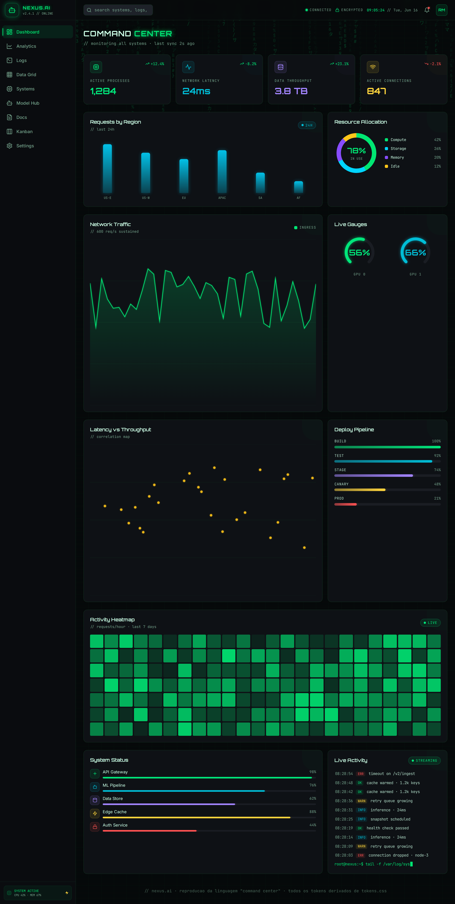
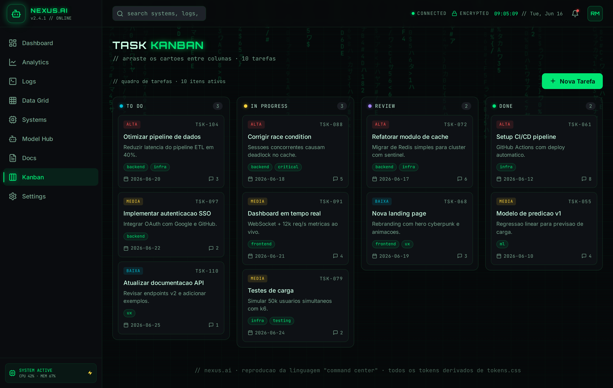

# App de referencia RODAVEL — HTML + CSS + JS (sem build)

Reproducao **fiel e executavel** do app de referencia (NEXUS.AI / NEURAL COMMAND),
com as **9 telas** navegaveis, animacoes de entrada e troca de tela, e graficos —
tudo em HTML+CSS+JS vanilla, sem framework nem etapa de build. Espelho dos prints
em [`../reference-app/`](../reference-app/), agora vivo.




## Como rodar

Por causa do import dos tokens (`../../assets/tokens.css`), sirva a partir da
**raiz da skill**:

```bash
# a partir de .claude/skills/painel-ins/
python3 -m http.server 4399
# abra http://127.0.0.1:4399/examples/html-css-app/
```

As 3 fontes (Orbitron, Inter, JetBrains Mono) vem do Google Fonts via `@import` —
requer internet na primeira carga.

## As 9 telas (roteamento por hash)

| Rota | Tela | Componentes-chave |
|---|---|---|
| `#/dashboard` | Command Center | KPIs, bar/donut/area/scatter, radial gauges, deploy pipeline, heatmap, status list, feed |
| `#/analytics` | Analytics Engine | barras agrupadas, line chart com pontos, donut, arc gauges, segmented |
| `#/logs` | System Logs | viewer terminal em tempo real, filtro por nivel, pause/clear, contador |
| `#/data` | Data Grid | tabela densa, status badges, selecao de linha, paginacao |
| `#/systems` | Systems Monitor | gauges radiais, progress bars, slider +/-, date, dropzone |
| `#/models` | Model Hub | selection cards (selecionavel), sliders, dropzone grande |
| `#/docs` | Docs Engine | template cards, input, textarea, tag input, select, save |
| `#/kanban` | Task Kanban | board drag-and-drop, priority badges, tags, contadores |
| `#/settings` | System Settings | tab pills, inputs/selects, toggles, info panel, action buttons |

## Arquitetura

| Arquivo | Papel |
|---|---|
| `index.html` | Shell: sidebar (9 itens) + topbar (busca, status, relogio vivo) + `#view`. |
| `styles.css` | Base compartilhada de componentes (copia do exemplo `html-css/`). |
| `app.css` | Adicoes do app: chips de topbar, **stagger de entrada/troca de tela**, heatmap, barras agrupadas, paginacao, dropzone, model cards, kanban, settings. |
| `charts.js` | Biblioteca de graficos SVG/Canvas (line, bars, donut, gauge, scatter, heatmap, sparkline). Cores via tokens. |
| `app.js` | Shell + **roteador por hash** + matrix rain + relogio. Cada troca de rota re-dispara a animacao de entrada com stagger. |
| `screens/<rota>.js` | Uma tela por arquivo. Registra `window.Screens[rota] = { head, accent, comment, render(), init(view) }`. |

**Como adicionar uma tela:** crie `screens/nova.js` registrando
`window.Screens.nova`, inclua o `<script>` no `index.html` e adicione a rota em
`ROUTES` (app.js) + um `<a data-route="nova">` na sidebar.

## Animacoes

- **Entrada de tela:** `#pageHead h2` entra primeiro; os filhos de `#view` entram
  em **stagger** (fade + translate, delay por indice via `--i`). Recriar o
  `innerHTML` a cada navegacao reinicia as animacoes — e o que produz o efeito de
  troca de tela. Ver `app.css`.
- **Vivas:** matrix rain de fundo, line chart e feed atualizando via
  `App.interval` (limpo a cada troca de rota), gauges/barras animando o valor,
  cursor piscando, pulsos de status.
- **Acessibilidade:** tudo respeita `prefers-reduced-motion` (matrix e timers
  desligados, transicoes zeradas).

## Regras seguidas

- **Zero hex no codigo** — toda cor vem de `hsl(var(--token) / alpha)`, via classes
  ou pelos helpers `App.hsl` / `Charts`.
- Tokens importados de `../../assets/tokens.css` (a fonte da verdade da skill).
