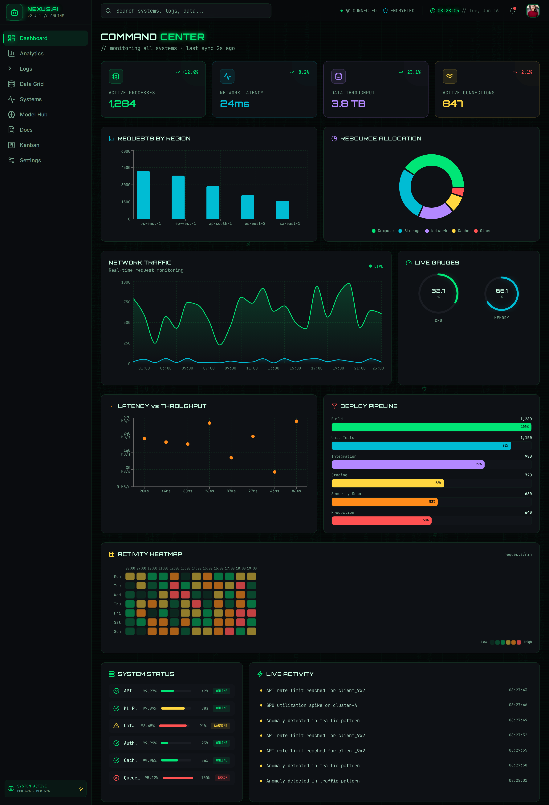
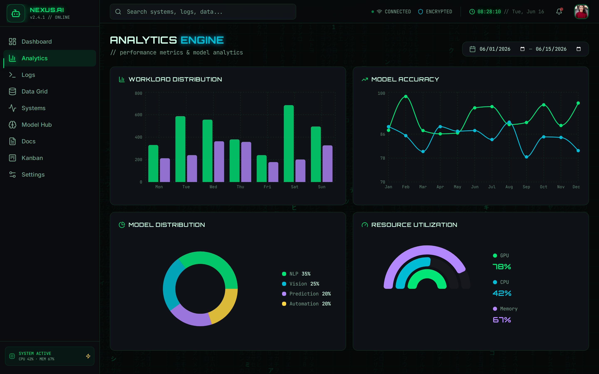
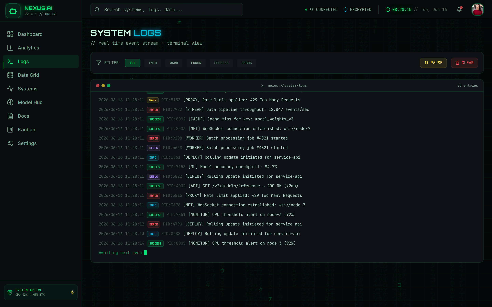
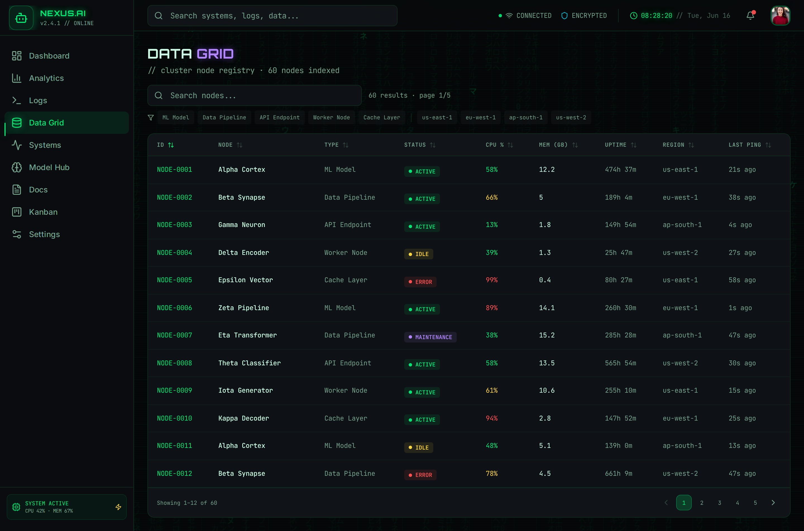
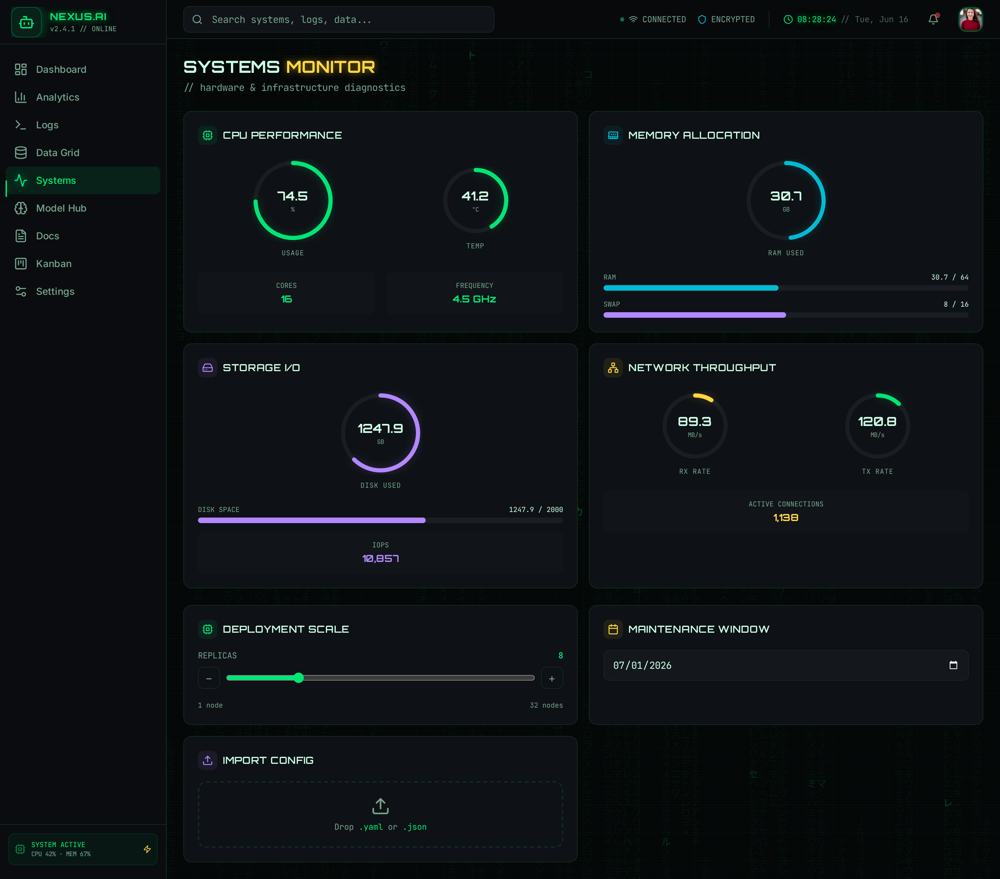
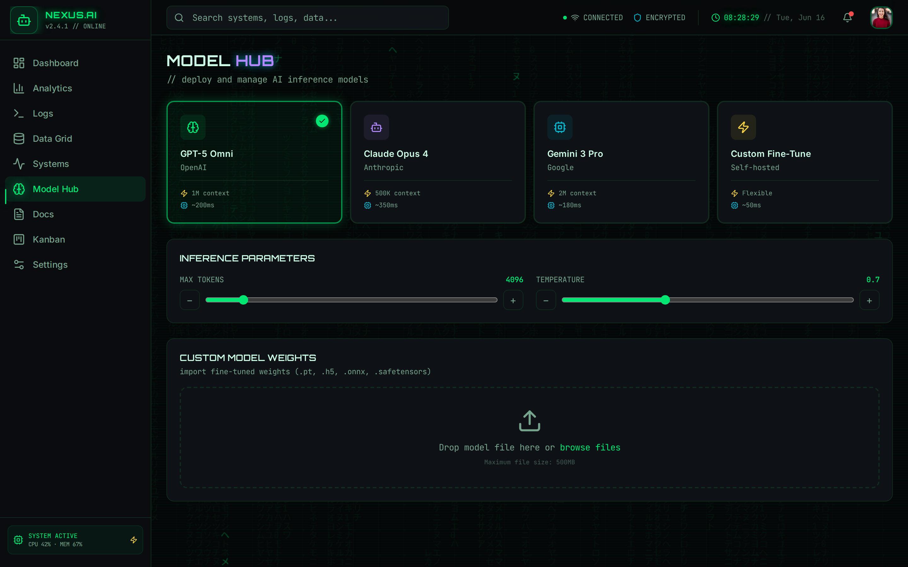
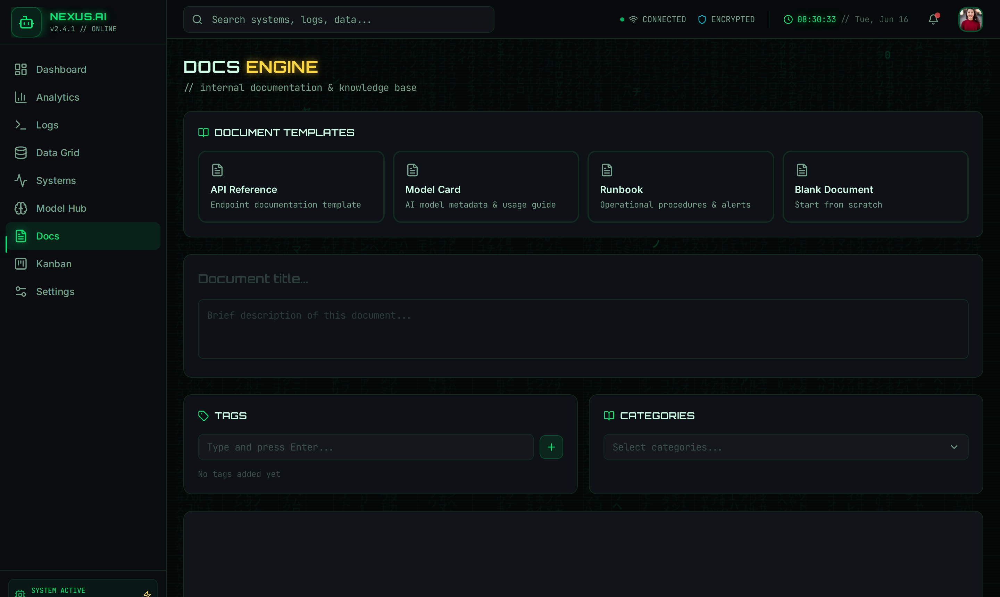
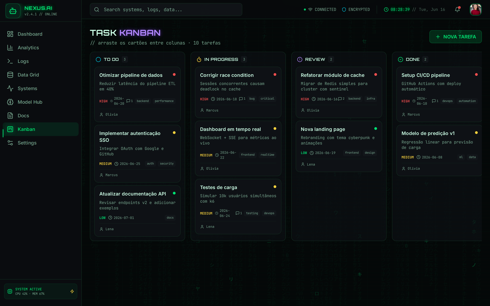
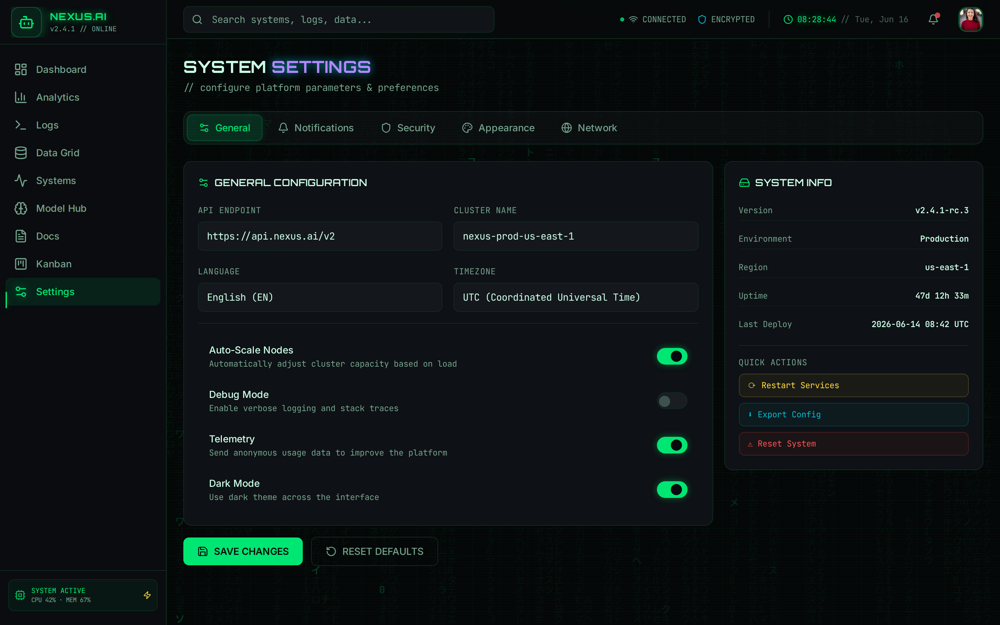

# App de referencia — NEXUS.AI / NEURAL COMMAND

Capturas do app onde a linguagem `painel-ins` foi originalmente prototipada.
Servem como **catalogo visual completo** de telas, campos, componentes e
animacoes — espelhe daqui ao montar telas novas.

- **URL ao vivo:** https://fractal-neural-command-core.base44.app
- **Stack:** SPA React (roteamento client-side, framer-motion).
- **9 telas**, cada uma exercitando um conjunto distinto de componentes.

> As imagens sao registro de referencia (nao codigo executavel). Para um exemplo
> rodavel e autocontido, veja [`../html-css/`](../html-css/).

---

## 1. Dashboard — `01-dashboard.png`



Visao geral densa. Componentes: **KPI/metric cards** (com delta +/-), **bar chart**
(requests by region), **donut/pie** (resource allocation), **area chart**
(network traffic), **radial gauges** (live gauges), **scatter plot** (latency vs
throughput), **lista de barras horizontais** (deploy pipeline), **activity
heatmap** (grade tipo calendario), **lista de status** com mini-barras e **feed
de atividade ao vivo**.

## 2. Analytics — `02-analytics.png`



Foco em graficos. Componentes: **bar chart agrupado** (workload distribution),
**line chart** com pontos (model accuracy), **donut com legenda** (model
distribution), **arc/radial gauges multiplos** (resource utilization) e
**date range picker** na topbar.

## 3. Logs — `03-logs.png`



Stream de eventos estilo terminal. Componentes: **log viewer em tempo real**,
**filtros por nivel** (ALL/INFO/WARN/ERROR/SUCCESS/DEBUG como chips/segmented),
**badges de nivel** coloridos, botoes **Pause/Clear**, cursor "awaiting next
event" piscando e contador de entries.

## 4. Data Grid — `04-data-grid.png`



Tabela de dados densa. Componentes: **data table** com colunas ordenaveis,
**busca**, **filtros** (chips/dropdowns), **status badges**
(ACTIVE/IDLE/ERROR/MAINTENANCE), **barras inline de %**, **paginacao numerada**
e contador de resultados.

## 5. Systems — `05-systems.png`



Monitor de hardware. Componentes: **radial gauges** (CPU/Memory/Storage/Network),
**progress bars** rotuladas, **slider** (deployment scale / replicas), **date
picker** (maintenance window) e **dropzone de upload** (import config).

## 6. Model Hub — `06-model-hub.png`



Selecao e configuracao de modelos. Componentes: **selection cards** (com estado
selecionado + check), **sliders** com +/- (max tokens, temperature) e **dropzone
de upload** grande (drop / browse files).

## 7. Docs — `07-docs.png`



Editor de documentos (recorte ate o formulario; o editor rico abaixo foi omitido).
Componentes: **template selection cards**, **text input** (titulo), **textarea**
(descricao), **tag input** (type and press Enter) e **select** (categories).

## 8. Kanban — `08-kanban.png`



Board de tarefas drag-and-drop. Componentes: **colunas** (TO DO/IN PROGRESS/
REVIEW/DONE) com contador, **cards de tarefa** arrastaveis com **priority badges**
(ALTA/MEDIA/BAIXA), datas, tags e botao **Nova Tarefa**.

## 9. Settings — `09-settings.png`



Configuracoes. Componentes: **tabs** (General/Notifications/Security/Appearance/
Network), **text inputs** (api endpoint, cluster name), **selects** (language,
timezone), **toggle switches** (auto-scale, debug, telemetry, dark mode), **painel
de info** (system info) e **botoes de acao** (restart/export/reset, save/reset).

---

## Animacoes observadas

- **Entrada de tela (mount):** o titulo aparece primeiro; em seguida os
  cards/blocos entram em **stagger** com fade + leve translate para cima
  (~`opacity 0→1`, `y 10→0`, delay por indice ~`0.08–0.1s`).
- **Troca de rota:** cada navegacao re-dispara essa entrada na nova tela; a
  **barra indicadora** da sidebar desliza ate o item ativo (transicao com
  `layoutId`).
- **Vivas/ambiente:** matrix rain de fundo, graficos atualizando ao vivo, pulsos
  em status e cursor piscando nos logs.

Especificacao canonica dessas animacoes (duracoes, easings, snippets) em
[`../../references/motion.md`](../../references/motion.md).

## Como recapturar

Script Playwright que percorre as 9 rotas (clica na sidebar, redimensiona o
viewport para a altura total e salva `NN-nome.png`):

```bash
# requer: npm i playwright && npx playwright install chromium
# rotas: / /analytics /logs /data /systems /models /docs /kanban /settings
# para cada uma: click no link -> waitForTimeout -> setViewportSize(altura total) -> screenshot
```
