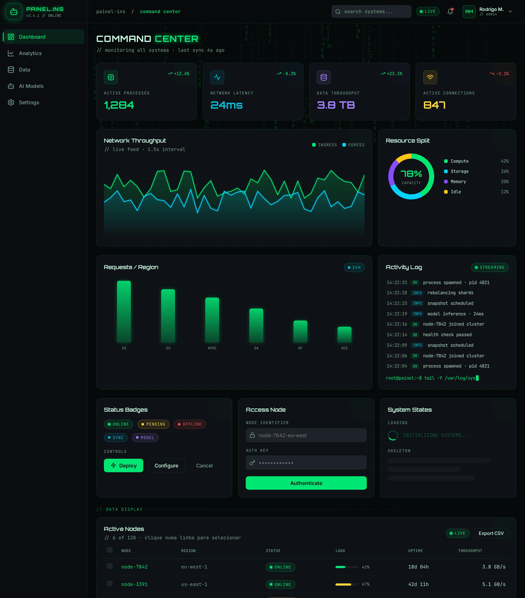

# skill-front

Repositorio que abriga a **skill `painel-ins`** para Claude Code — uma
**linguagem visual reutilizavel** no estilo _"command center"_ (dashboard
cyberpunk: fundo near-black, neon verde dominante, estetica HUD/terminal e
microanimacoes).



## Instalação

Instale direto deste repositório no GitHub — **um comando**, sem publicar em
registro nenhum (copia a skill para `.claude/skills/`):

```bash
# no diretorio do projeto
npx github:insanemor/skill-front
```

```bash
# ou disponivel em todos os projetos (global do usuario)
npx github:insanemor/skill-front --global
```

> Roda em qualquer projeto. Para fixar uma versão, use uma tag/branch:
> `npx github:insanemor/skill-front#v1.0.0`.

| Opção | Efeito |
|---|---|
| _(padrão)_ | instala em `./.claude/skills/painel-ins` (projeto atual) |
| `--global`, `-g` | instala em `~/.claude/skills/painel-ins` |
| `--dir <path>` | usa um diretório `skills` específico |
| `--force`, `-f` | sobrescreve uma instalação existente |
| `--help`, `-h` | ajuda |

Depois, abra o Claude Code no projeto e use **`/painel-ins`** (ou peça um dashboard
— a skill é acionada automaticamente). O instalador é enxuto (~84 kB): leva o
conteúdo textual da skill; os screenshots da galeria ficam aqui no repositório.

## Objetivo

Padronizar a aparencia de qualquer front-end — dashboard, painel, tela de admin
ou landing — atraves de **regras + tokens** independentes de tecnologia, em vez
de recriar o estilo do zero a cada projeto.

A skill nao e um componente nem um tema preso a um framework: e a **fonte da
verdade** do design (cores, tipografia, layout, efeitos, motion e anatomia de
componentes). O codigo de cada stack (React/Tailwind, Vue, Svelte, HTML+CSS, PHP,
Django templates...) e **derivado** desses tokens. Quando ha Tailwind, mapeiam-se
os tokens no `theme`; quando nao ha, importa-se `assets/tokens.css`.

## Como usar

Depois de instalar, a skill já está disponível no Claude Code daquele projeto.
Há duas formas de acioná-la:

**1. Automática** — basta pedir uma interface no estilo. O Claude detecta e aplica
a linguagem sozinho:

```
crie um dashboard de monitoramento de nós
estilize esta tela de login no padrão command center
revise este componente e deixe no nosso visual
```

**2. Explícita** — invoque pelo nome com `/painel-ins`:

```
/painel-ins crie um painel de analytics com gráficos e uma tabela de dados
/painel-ins monte uma tela de settings com abas e toggles
```

**O que o Claude faz** ao aplicar a skill: detecta o stack do projeto → instala os
tokens (Tailwind `theme` ou `assets/tokens.css`) → carrega as 3 fontes → aplica
efeitos globais (grid, scanline, glow) → monta os componentes pela anatomia de
referência → anima de forma discreta. A **topbar sempre inclui** os dropdowns de
usuário e de notificações (componentes obrigatórios da skill).

**O que você recebe:** uma UI fiel ao modelo — fundo near-black, neon verde, voz
HUD/terminal, microanimações de entrada/troca de tela — derivada dos tokens (zero
cor hex solta no código).

> **Espelhe os exemplos.** A skill traz exemplos rodáveis para o Claude (e você)
> usarem de referência: `examples/html-css-app/` (SPA com as 9 telas),
> `examples/html-css/` (kitchen-sink de componentes) e `examples/react-tailwind/`.
> Detalhes e a galeria de telas em [`docs/painel-ins.md`](docs/painel-ins.md).

### Verificar a instalação

```bash
ls .claude/skills/painel-ins/SKILL.md   # deve existir após instalar
```

## O DNA em 10 segundos

- Fundo **near-black azulado** (`hsl(220 20% 4%)`), nunca branco.
- **Uma** neon dominante: **verde** `hsl(150 100% 45%)`. Outras (roxo, ciano,
  laranja, amarelo, vermelho) entram so com significado semantico.
- Voz **HUD/terminal**: metadados em mono MAIUSCULO `tracking-wider`, subtitulos
  `// comentario`, titulos em Orbitron com palavra em neon.
- **Glow** sutil, texturas de **grid** + **scanline**, microanimacoes curtas
  (0.2–0.5s) que respeitam `prefers-reduced-motion`.

## Estrutura

```
.claude/skills/painel-ins/
├── SKILL.md                 # entrada: DNA, regras, workflow, indice
├── assets/                  # fonte da verdade dos tokens
│   ├── tokens.css           #   CSS variables (qualquer stack)
│   └── tokens.json          #   os mesmos tokens em JSON
├── references/              # o "porque" + especificacoes (carregadas sob demanda)
│   ├── design-principles.md
│   ├── color-tokens.md
│   ├── typography.md
│   ├── layout.md
│   ├── components.md
│   ├── motion.md
│   └── effects.md
└── examples/
    ├── html-css/            # dashboard completo autocontido (sem build) + 3 screenshots
    ├── html-css-app/        # SPA rodavel: reproducao das 9 telas (roteamento + animacoes)
    ├── react-tailwind/      # implementacao de referencia (MetricCard, Sidebar, AppLayout)
    └── reference-app/       # galeria de 9 telas do app original (catalogo visual completo)
```

## Exemplo vivo

O exemplo [`examples/html-css/`](.claude/skills/painel-ins/examples/html-css/)
e um **dashboard completo, autocontido e sem build** (HTML+CSS+JS vanilla) que
valida a skill e serve de espelho ao montar telas novas. Cobre todos os pilares e
um catalogo amplo de componentes — tabela de dados, radial gauges, alertas,
formulario completo, tabs, overlays e modal/dialog. Veja a galeria de prints na
[documentacao](docs/painel-ins.md#5-galeria-de-componentes).

Alem disso, a [galeria do app de referencia](.claude/skills/painel-ins/examples/reference-app/)
(9 telas: Dashboard, Analytics, Logs, Data Grid, Systems, Model Hub, Docs, Kanban,
Settings) e o catalogo visual mais amplo — todos os campos, componentes, graficos
e animacoes de entrada/troca de tela.

```bash
# a partir de .claude/skills/painel-ins/
python3 -m http.server 4321
# abra http://127.0.0.1:4321/examples/html-css/
```

## Documentacao

Visao geral completa, principios, tabela de tokens e galeria de componentes em
**[`docs/painel-ins.md`](docs/painel-ins.md)**.
