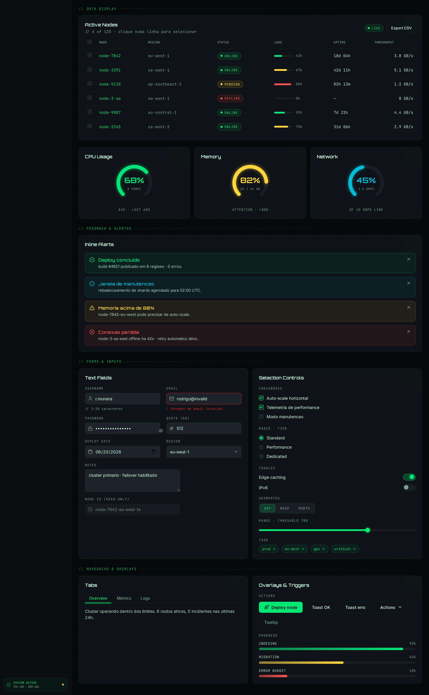
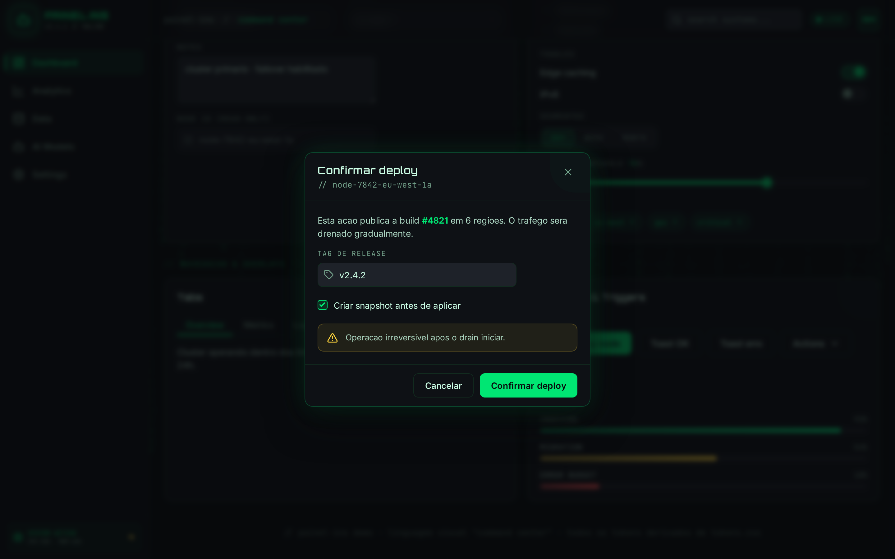

# Documentacao — skill `painel-ins`

Linguagem visual _"command center"_ para Claude Code: um modelo de design
**reutilizavel e agnostico de tecnologia** cujo nucleo sao **regras + tokens**.
Esta doc explica o objetivo, os principios, os tokens e mostra o que a skill
produz na pratica.

> Fonte da verdade do conteudo: [`.claude/skills/painel-ins/`](../.claude/skills/painel-ins/).
> Esta pagina e um guia de leitura; os arquivos da skill mandam em caso de divergencia.

---

## 1. Por que existe

Sem um padrao, cada front-end novo (dashboard, painel admin, landing) reinventa
cores, fontes, espacamentos e efeitos — gerando inconsistencia e retrabalho. A
skill resolve isso fixando **uma** linguagem visual e tornando o codigo de cada
stack um **derivado** dela:

- **Tokens** sao a fonte da verdade — definidos uma vez em `assets/tokens.css` e
  `assets/tokens.json`.
- **Regras** dizem como compor (uma neon dominante, glow como verniz, voz HUD...).
- **Exemplos** mostram a aplicacao concreta (HTML+CSS e React/Tailwind).

Resultado: qualquer tela "parece painel-ins" sem copiar pixels — copia-se a
anatomia e referenciam-se os tokens.

---

## 2. DNA do visual

- Fundo **near-black azulado** (`hsl(220 20% 4%)`), nunca preto puro nem branco.
- **Uma** cor neon dominante: **verde** `hsl(150 100% 45%)`, que marca o que esta
  ativo, vivo, selecionado ou e a acao principal.
- Acentos neon (roxo, ciano, laranja, amarelo, vermelho) entram **so com
  significado** semantico/categorico — nunca decoracao.
- Estetica **HUD/terminal**: metadados em fonte mono, MAIUSCULAS, `tracking-wider`;
  subtitulos no estilo `// comentario`; rotulos como `v2.4.1 // ONLINE`.
- Tipografia: **Orbitron** (display), **Inter** (corpo), **JetBrains Mono** (dados/labels).
- **Glow** sutil, texturas de **grid** (40px) e **scanline**, microanimacoes
  curtas (0.2–0.5s) que respeitam `prefers-reduced-motion`.
- Cantos arredondados (`radius 0.5rem`), bordas neon de baixa opacidade (`/10`–`/30`).


---

## 3. Principios (o "porque")

Resumo de [`references/design-principles.md`](../.claude/skills/painel-ins/references/design-principles.md):

1. **Dark-first, near-black azulado** — profundidade por camadas sutis de
   luminosidade (4%–12%), nao por bordas grossas. Separacao vem de borda neon de
   baixa opacidade e glow.
2. **Um neon manda na tela** — verde e a identidade; as outras sao semanticas.
3. **Estetica HUD/terminal** — parece um painel de controle de ficcao cientifica.
4. **Densidade com respiro** — muita informacao, mas em grids com gaps consistentes.
5. **Movimento como sinal de vida** — o painel "respira", sempre curto e sutil.
6. **Glow e verniz, nao estrutura** — legibilidade precisa funcionar sem o glow.

---

## 4. Tokens semanticos

Todas as cores sao tokens HSL (`H S% L%`) pensados para compor com alpha
(`hsl(var(--primary) / 0.1)`). **Regra de ouro: nunca escreva hex no markup** —
hex so vive em `assets/tokens.css`.

| Token | Valor (HSL) | Usar para |
|---|---|---|
| `background` | `220 20% 4%` | fundo da pagina |
| `foreground` | `150 100% 90%` | texto principal |
| `card` | `220 20% 7%` | superficie de cards/paineis |
| `popover` | `220 20% 6%` | menus, dropdowns, tooltips |
| `primary` | `150 100% 45%` | acao principal, item ativo, marca (VERDE) |
| `secondary` | `260 100% 65%` | acao/realce secundario (roxo) |
| `accent` | `150 60% 40%` | realce sutil, hover de superficie |
| `destructive` | `0 85% 55%` | erro, exclusao, queda |
| `muted` | `220 15% 12%` | fundos discretos, chips |
| `muted-foreground` | `150 20% 55%` | texto secundario, legendas |
| `border` | `150 40% 12%` | bordas (use com alpha p/ sutileza) |
| `input` | `220 15% 14%` | fundo de campos |
| `ring` | `150 100% 45%` | anel de foco |

**Camadas translucidas** (o visual depende disso): fundo ativo `primary / 0.05–0.10`,
borda neon `primary / 0.10–0.30`, texto/icone ativo `primary` cheio. Em Tailwind:
`bg-primary/10 border border-primary/30 text-primary`.

**Series de grafico** (nesta ordem): verde → ciano → roxo → amarelo → vermelho.

Detalhes e a paleta neon categorica em
[`references/color-tokens.md`](../.claude/skills/painel-ins/references/color-tokens.md).

---

## 5. Galeria de componentes

O exemplo `examples/html-css/` cataloga **todos os tipos de campo e componente**
ja estilizados. Use como espelho ao montar telas novas.

### Kitchen-sink

Tabela de dados (badges de status, barras de carga), radial gauges
(CPU/Memory/Network), alertas inline (sucesso/info/aviso/erro), formulario
completo (text fields com validacao, checkbox, radio, toggle, segmented control,
range, tags, select, textarea, read-only), tabs e overlays (toasts, tooltip,
dropdown, progress bars):



### Modal / dialog

Com backdrop semitransparente (overlay desfocado, foco no card):



---

## 6. Como aplicar (workflow)

1. Identifique o **stack-alvo** do projeto.
2. **Instale os tokens**: Tailwind → mapeie no `theme.extend.colors` apontando
   para CSS vars (ver `examples/react-tailwind/theme-setup.md`); outros stacks →
   importe `assets/tokens.css`.
3. **Carregue as 3 fontes** (Orbitron, Inter, JetBrains Mono) — ver
   [`references/typography.md`](../.claude/skills/painel-ins/references/typography.md).
4. **Aplique efeitos globais** (`grid-bg`, `scanline`, scrollbar) no container
   raiz — ver [`references/effects.md`](../.claude/skills/painel-ins/references/effects.md).
5. **Monte componentes** seguindo a anatomia de
   [`references/components.md`](../.claude/skills/painel-ins/references/components.md).
6. **Anime** conforme [`references/motion.md`](../.claude/skills/painel-ins/references/motion.md).

---

## 7. Indice de referencias

Carregadas sob demanda pela skill:

| Arquivo | Conteudo |
|---|---|
| [`design-principles.md`](../.claude/skills/painel-ins/references/design-principles.md) | filosofia visual e o "porque" |
| [`color-tokens.md`](../.claude/skills/painel-ins/references/color-tokens.md) | paleta semantica, valores exatos, quando usar |
| [`typography.md`](../.claude/skills/painel-ins/references/typography.md) | fontes, escala, convencoes de texto |
| [`layout.md`](../.claude/skills/painel-ins/references/layout.md) | sidebar, topbar, grids, espacamentos |
| [`components.md`](../.claude/skills/painel-ins/references/components.md) | anatomia agnostica dos padroes |
| [`motion.md`](../.claude/skills/painel-ins/references/motion.md) | duracoes, easings, padroes de animacao |
| [`effects.md`](../.claude/skills/painel-ins/references/effects.md) | glow, scanline, grid-bg, matrix rain, pulse, scrollbar |

---

## 8. Rodar o exemplo localmente

Por causa do import relativo dos tokens (`../../assets/tokens.css`), sirva a
partir da **raiz da skill**:

```bash
# a partir de .claude/skills/painel-ins/
python3 -m http.server 4321
# abra http://127.0.0.1:4321/examples/html-css/
```

As 3 fontes vem do Google Fonts via `@import` — requer internet na primeira carga.
Instrucoes de regeneracao dos screenshots no
[README do exemplo](../.claude/skills/painel-ins/examples/html-css/README.md).
